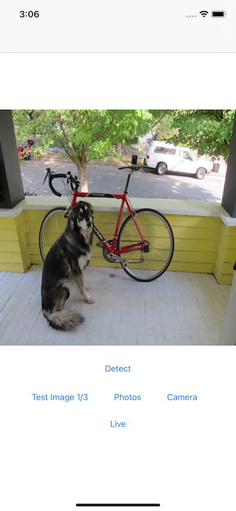
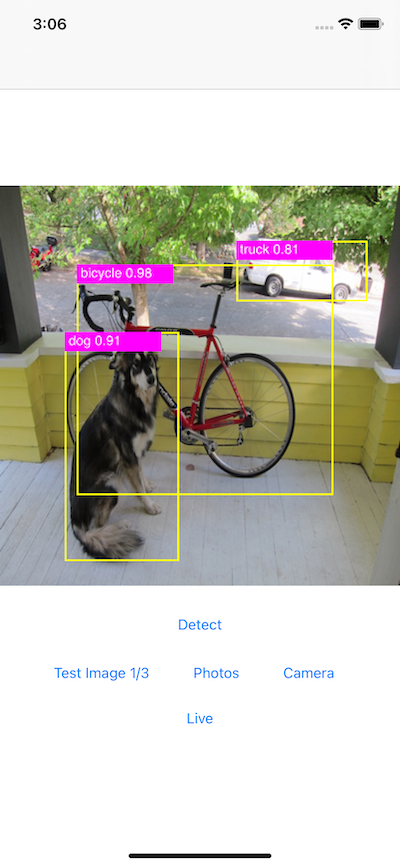
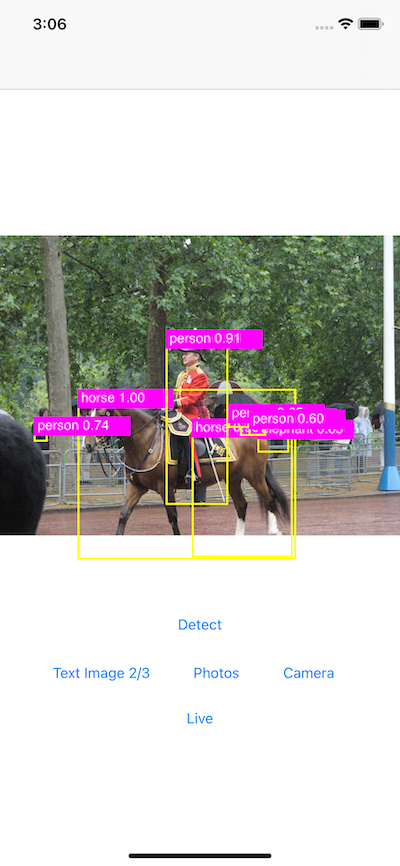
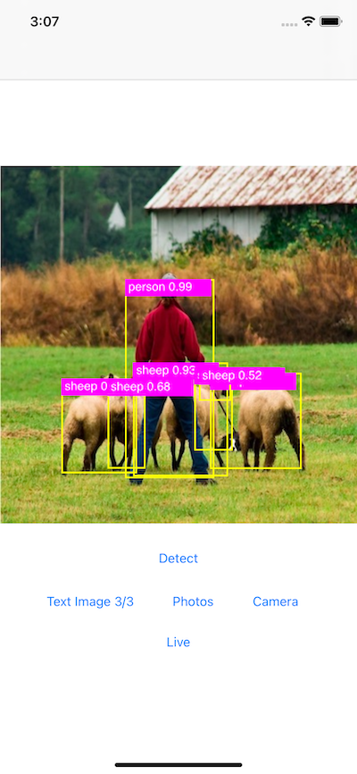

# D2Go Object Detection on iOS

## Introduction

[Detectron2](https://github.com/facebookresearch/detectron2) is one of the most widely adopted open source projects and implements state-of-the-art object detection, semantic segmentation, panoptic segmentation, and human pose prediction. [D2Go](https://github.com/facebookresearch/d2go) is powered by PyTorch 1.9.0, torchvision 0.10.0, and Detectron2 with built-in SOTA networks for mobile - the D2Go model is very small (only 2.15MB) and runs very fast on iOS.

This D2Go iOS demo app shows how to prepare and use the D2Go model on iOS with the newly released LibTorchvision Cocoapods. The code is based on a previous PyTorch iOS [Object Detection demo app](https://github.com/pytorch/ios-demo-app/tree/master/ObjectDetection) that uses a pre-trained YOLOv5 model, with modified pre-processing and post-processing code required by the D2Go model.

## Prerequisites

* PyTorch 1.9 and torchvision 0.10 (Optional)
* Python 3.8 or above (Optional)
* iOS Cocoapods LibTorch 1.9.0 and LibTorchvision 0.10.0
* Xcode 12.4 or later

## Quick Start

This section shows how to create and use the D2Go model in an iOS app. To just build and run the app without creating the D2Go model yourself, go directly to Step 4.

1. Install PyTorch 1.9.0 and torchvision 0.10.0, for example:

```
conda create -n d2go python=3.8.5
conda activate d2go
pip install torch torchvision
```

2. Install Detectron2, mobile_cv, and D2Go

```
python -m pip install 'git+https://github.com/facebookresearch/detectron2.git'
python -m pip install 'git+https://github.com/facebookresearch/mobile-vision.git'
git clone https://github.com/facebookresearch/d2go
cd d2go && python -m pip install .

```

3. Create the D2Go model

First, clone the project:

```
git clone https://github.com/pytorch/ios-demo-app
cd ios-demo-app/D2Go
```

Next, for the model to have the best accuracy, download the COCO dataset [annotations](http://images.cocodataset.org/annotations/annotations_trainval2017.zip) and [images](http://images.cocodataset.org/zips/train2017.zip). Unzip the two files and put the unzipped `train2017` and `annotations` folders to the `datasets/coco` folder inside `D2Go`.

Run the following command to create the optimized D2Go model `d2go_optimized.pt`:
```
python create_d2go.py
```

4. Build and run the D2Go iOS app

If you have not gone through Step 3, simply run `git clone https://github.com/pytorch/ios-demo-app` first, then `cd ios-demo-app/D2Go`.

Run the commands below:

```
pod install
open D2Go.xcworkspace/
```

Select an iOS simulator or device on Xcode to run the app. If you get an error `Unknown builtin op: torchvision::nms.
Could not find any similar ops to torchvision::nms.` caused by a possible Cocoapods bug while running the app, you can fix it by going to the app target's Build Settings - Other Linker Flags in Xcode: make sure `-force_load $(PODS_ROOT)/LibTorchvision/install/lib/libtorchvision_ops.a` is added or manually add it if not.

After the app runs, you can go through the included example test images to see the detection results. You can also select a picture from your iOS device's Photos library, take a picture with the device camera, or even use live camera to do object detection - see this [video](https://drive.google.com/file/d/1GO2Ykfv5ut2Mfoc06Y3QUTFkS7407YA4/view) for a screencast of the app running.

Some example images and the detection results are as follows:






