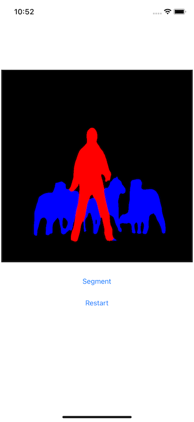

## Quick Start

To Test Run the Image Segmentation iOS App, follow the steps below:

### 1. Prepare the Model

Open a Mac Terminal, run the following commands:

```
git clone https://github.com/pytorch/ios-demo-app
cd ios-demo-app/ImageSegmentation
python deeplabv3.py
```

The Python script `deeplabv3.py` is used to generate the TorchScript-formatted model for mobile apps. If you don't have the PyTorch environment set up to run the script, you can download the model file to the `ios-demo-app/ImageSegmentation` folder using the link [here](https://drive.google.com/file/d/17KeE6mKo67l14XxTl8a-NbtqwAvduVZG/view?usp=sharing).

Then run `mv deeplabv3_scripted.pt ImageSegmentation` to move the model file to the right location.

### 2. Use LibTorch

Run the commands below:

```
pod install
open ImageSegmentation.xcworkspace/
```

### 3. Run the app
Select an iOS simulator or device on Xcode to run the app. The example image and its segmented result are as follows:

results are:



