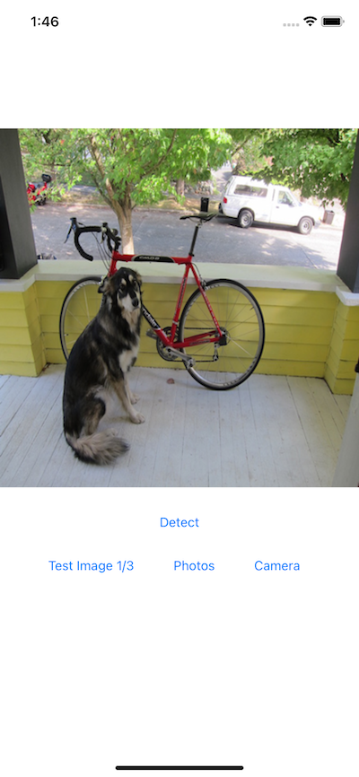
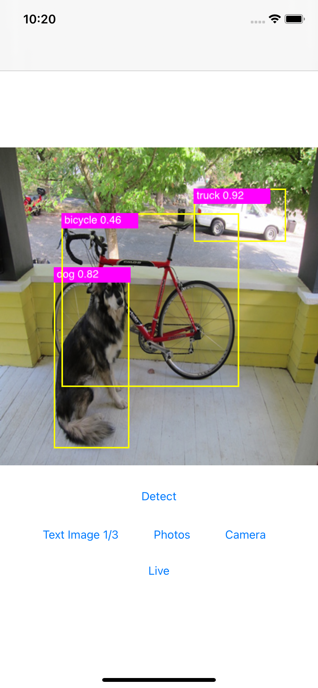
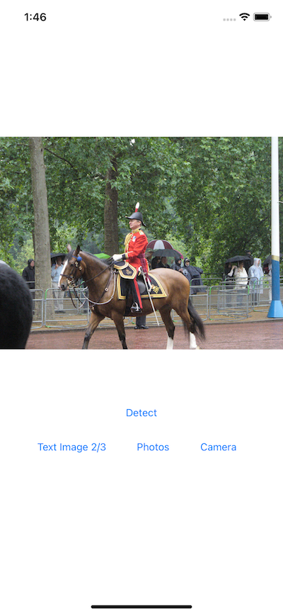
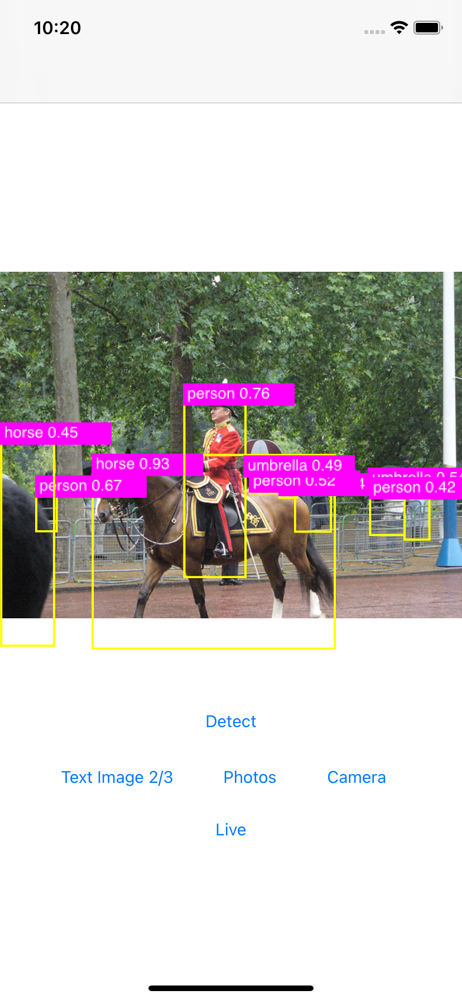

# Object Detection with YOLOv5 on iOS

## Introduction

[YOLO](https://pjreddie.com/darknet/yolo/) (You Only Look Once) is one of the fastest and most popular object detection models. [YOLOv5](https://github.com/ultralytics/yolov5) is an open-source implementation of the latest version of YOLO (for a quick test of loading YOLOv5 from PyTorch hub for inference, see [here](https://pytorch.org/hub/ultralytics_yolov5/#load-from-pytorch-hub)). This Object Detection with YOLOv5 iOS sample app uses the PyTorch scripted YOLOv5 model to detect objects of the [80 classes](https://github.com/ultralytics/yolov5/blob/master/data/coco.yaml) trained with the model.

## Prerequisites

* PyTorch 1.7 or later (Optional)
* Python 3.8 (Optional)
* iOS Pytorch pod library 1.7
* Xcode 12 or later

## Quick Start

To Test Run the Object Detection iOS App, follow the steps below:

### 1. Prepare the Model

If you don't have the PyTorch environment set up to run the script, you can download the model file [here](https://drive.google.com/file/d/1QOxNfpy_j_1KbuhN8INw2AgAC82nEw0F/view?usp=sharing) to the `ios-demo-app/ObjectDetection/ObjectDetection` folder, then skip the rest of this step and go to step 2 directly.

Be aware that the downloadable model file was created with PyTorch 1.7.0, matching the iOS LibTorch library 1.7.0 specified in the `Podfile`. If you use a different version of PyTorch to create your model by following the instructions below, make sure you specify the same iOS LibTorch version in the `Podfile` to avoid possible errors caused by the version mismatch. Furthermore, if you want to use the latest prototype features in the PyTorch master branch to create the model, follow the steps at [Building PyTorch iOS Libraries from Source](https://pytorch.org/mobile/ios/#build-pytorch-ios-libraries-from-source) on how to use the model in iOS.

The Python script `export.py` in the `models` folder of the [YOLOv5 repo](https://github.com/ultralytics/yolov5) is used to generate a TorchScript-formatted YOLOv5 model named `yolov5s.torchscript.pt` for mobile apps.

Open a Mac/Linux/Windows Terminal, run the following commands (note that we use the fork of the original YOLOv5 repo to make sure the code changes work, but feel free to use the original repo):

```
git clone https://github.com/jeffxtang/yolov5
cd yolov5
pip install -r requirements.txt
```

Then edit `models/export.py` to make two changes:

* Change the line 50 from `model.model[-1].export = True` to `model.model[-1].export = False`

* Add the following two lines of model optimization code after line 57, between `ts = torch.jit.trace(model, img)` and `ts.save(f)`:

```
    from torch.utils.mobile_optimizer import optimize_for_mobile
    ts = optimize_for_mobile(ts)
```

If you ignore this step, you can still create a TorchScript model for mobile apps to use, but the inference on a non-optimized model can take twice as long as the inference on an optimized model - using the iOS app test images, the average inference time on an optimized and non-optimized model is 0.6 seconds and 1.18 seconds, respectively. See [SCRIPT AND OPTIMIZE FOR MOBILE RECIPE](https://pytorch.org/tutorials/recipes/script_optimized.html) for more details.

Finally, run the script below to generate the optimized TorchScript model and copy the generated model file `yolov5s.torchscript.pt` to the `ios-demo-app/ObjectDetection/ObjectDetection` folder:

```
python models/export.py
```

Note that small sized version of the YOLOv5 model, which runs faster but with less accuracy, is generated by default when running the `export.py`. You can also change the value of the `weights` parameter in the `export.py` to generate the medium, large, and extra large version of the model.

### 2. Use LibTorch

Run the commands below:

```
pod install
open ObjectDetection.xcworkspace/
```

### 3. Run the app
Select an iOS simulator or device on Xcode to run the app. You can go through the included example test images to see the detection results. You can also select a picture from your iOS device's Photos library, take a picture with the device camera, or even use live camera to do object detection - see this [video](https://drive.google.com/file/d/1pIDrUDnCD5uF-mIz8nbSlZcXxPlRBKhl/view) for a screencast of the app running.

Some example images and the detection results are as follows:






