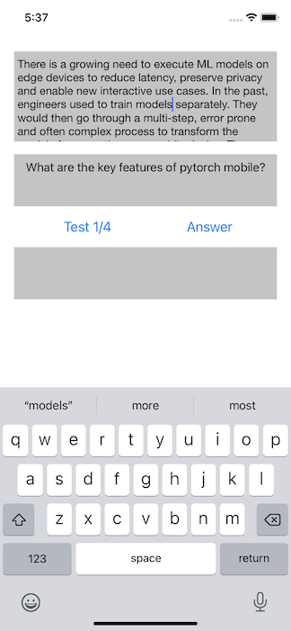
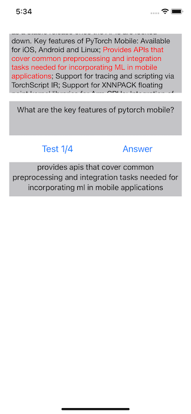
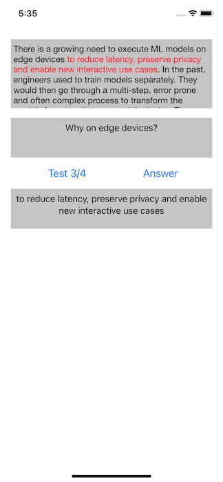

# Question Answering on iOS

## Introduction

Question Answering (QA) is one of the common and challenging Natural Language Processing tasks. With the revolutionary transformed-based [Bert](https://arxiv.org/abs/1810.04805) model coming out in October 2018, question answering models have reached their state of art accuracy by fine-tuning Bert-like models on QA datasets such as [Squad](https://rajpurkar.github.io/SQuAD-explorer). [Huggingface](https://huggingface.co)'s [DistilBert](https://huggingface.co/transformers/model_doc/distilbert.html) is a smaller and faster version of BERT - DistilBert "has 40% less parameters than bert-base-uncased, runs 60% faster while preserving over 95% of BERT’s performances as measured on the GLUE language understanding benchmark."

In this demo app, we'll show how to quantize and convert the Huggingface's DistilBert QA model to TorchScript and how to use the scripted model on an iOS demo app to perform question answering.

## Prerequisites

* PyTorch 1.9 or later (Optional)
* Python 3.8 (Optional)
* iOS Cocoapods LibTorch-Lite 1.9.0
* Xcode 12 or later

## Quick Start

To Test Run the iOS QA demo app, run the following commands on a Terminal:

### 1. Prepare the Model

If you don't have PyTorch installed or want to have a quick try of the demo app, you can download the scripted QA model compressed in a zip file [here](https://drive.google.com/file/d/1PgD3pAEf0riUiT3BfwHOm6UEGk8FfJzI/view?usp=sharing), then unzip, drag and drop it to the project, and continue to Step 2.

Be aware that the downloadable model file was created with PyTorch 1.9.0, matching the iOS LibTorch library 1.9.0 specified in the `Podfile`. If you use a different version of PyTorch to create your model by following the instructions below, make sure you specify the same iOS LibTorch version in the `Podfile` to avoid possible errors caused by the version mismatch. Furthermore, if you want to use the latest prototype features in the PyTorch master branch to create the model, follow the steps at [Building PyTorch iOS Libraries from Source](https://pytorch.org/mobile/ios/#build-pytorch-ios-libraries-from-source) on how to use the model in iOS.

With PyTorch 1.9.0 installed, first install the Huggingface `transformers` 4.6.1 (newer version may have some issue) by running `pip install transformers==4.6.1`, then run `python convert_distilbert_qa.py`.

Note that a pre-defined question and text, resulting in the size of the input tokens (of question and text) being 360, is used in the `convert_distilbert_qa.py`, and 360 is the maximum token size for the user text and question in the app. If the token size of the inputs of the text and question is less than 360, padding will be needed to make the model work correctly.

After the script completes, drag and drop the model file `qa360_quantized.ptl` to the iOS app project. [Dynamic quantization](https://pytorch.org/tutorials/intermediate/dynamic_quantization_bert_tutorial.html) is used to quantize the model to reduce its size to half, without causing inference difference in question answering - you can verify this changing the last 4 lines of code in `convert_distilbert_qa.py` from:

```
model_dynamic_quantized = torch.quantization.quantize_dynamic(model, qconfig_spec={torch.nn.Linear}, dtype=torch.qint8)
traced_model = torch.jit.trace(model_dynamic_quantized, inputs['input_ids'], strict=False)
optimized_traced_model = optimize_for_mobile(traced_model)
optimized_traced_model._save_for_lite_interpreter("QuestionAnswering/qa360_quantized.ptl")
```

to

```
traced_model = torch.jit.trace(model, inputs['input_ids'], strict=False)
optimized_traced_model = optimize_for_mobile(traced_model)
optimized_traced_model._save_for_lite_interpreter("QuestionAnswering/qa360_quantized.ptl")
```

and rerun `python convert_distilbert_qa.py` to generate a non-quantized model and use it in the app to compare with the quantized version.

### 2. Use LibTorch-Lite

Run the commands below:

```
cd QuestionAnswering
pod install
open QuestionAnswering.xcworkspace/
```

### 3. Build and run with Xcode

Select an iOS simulator or device on Xcode to run the app. See this [video](https://drive.google.com/file/d/1QIB3yoP4I3zUU0bLCpvUqPV5Kv8f8JvB/view) for a screencast of the app running. Some example results are as follows:




