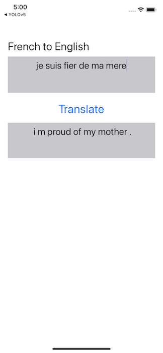
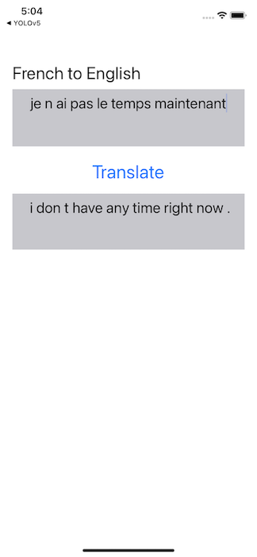
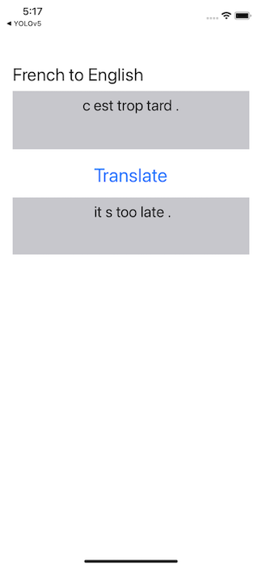

# Neural Machine Translation on iOS

## Introduction

The PyTorch tutorial [NLP FROM SCRATCH: TRANSLATION WITH A SEQUENCE TO SEQUENCE NETWORK AND ATTENTION](https://pytorch.org/tutorials/intermediate/seq2seq_translation_tutorial.html) is an easy-to-follow tutorial that has step-by-step instructions on how to train sequence to sequence encoder and decode networks with an attention mechanism for neural machine translation. Although the quality of the translation between English and French using the model in the tutorial may not be as good as a leading-edge transformer based model, it presents a great example of how to deploy an interesting model trained from scratch in an iOS app.

This iOS demo app shows:

* The Python code that saves the encoder and attention-enhanced decoder models, trained based on the code in the PyTorch NMT tutorial;
* The Python code that loads the saved encoder and decoder models, optimizes them and saves again for mobile apps to use;
* The iOS app that uses the encoder and decoder models to do French-English translation.

## Prerequisites

* PyTorch 1.7 or later (Optional)
* Python 3.8 (Optional)
* iOS Pytorch pod library 1.7
* Xcode 12 or later

## Quick Start

To Test Run the Object Detection iOS App, follow the steps below:

### 1. Prepare the Model

If you don't have the PyTorch environment set up to run the script, you can download the PyTorch trained and optimized NMT encoder and decoder models compressed in a zip [here](https://drive.google.com/file/d/1Ju9ceHi5e87UW1P09-XIvPVdMjOs5kiE/view?usp=sharing), unzip it, copy to the iOS app project folder, and continue to Step 2.

Be aware that the downloadable model files were created with PyTorch 1.7.0, matching the iOS LibTorch library 1.7.0 specified in the `Podfile`. If you use a different version of PyTorch to create your model by following the instructions below, make sure you specify the same iOS LibTorch version in the `Podfile` to avoid possible errors caused by the version mismatch. Furthermore, if you want to use the latest prototype features in the PyTorch master branch to create the model, follow the steps at [Building PyTorch iOS Libraries from Source](https://pytorch.org/mobile/ios/#build-pytorch-ios-libraries-from-source) on how to use the model in iOS.

If you have a good GPU and want to train your model from scratch, uncomment the line `trainIters(encoder, decoder, 450100, print_every=5000)` in `seq2seq_nmt.py` before running `python seq2seq2_nmt.py` to go through the whole process of training, saving, loading, optimizing and saving the final mobile-ready models.

To just convert a pre-trained model `seq2seq_mt_150000.pt` to the TorchScript model used on mobile, download [seq2seq_mt_150000.pt](https://drive.google.com/file/d/1f91PvlkxS8JS0xGpMRZ3fmr0Ev80Guxk/view?usp=sharing) first to the same directory as `seq2seq2_nmt.py`, then run `python seq2seq2_nmt.py`. After `optimized_encoder_150k.pth` and `optimized_decoder_150k.pth` are generated, copy them to the iOS app. Note that dynamic quantization is applied to the decoder in `seq2seq2_nmt.py` for its `nn.Linear` parameters to reduce the decoder model size from 29MB to 18MB.

### 2. Use LibTorch

Run the commands below:

```
cd Seq2SeqNMT
pod install
open Seq2SeqNMT.xcworkspace/
```

### 3. Build and run with Xcode

Select an iOS simulator or device on Xcode to run the app. See this [video](https://drive.google.com/file/d/17Edk-yAyfzijHPR_2ZDAIX7VY-TkQnLf/view) for a screencast of the app running.Some example results are as follows:




