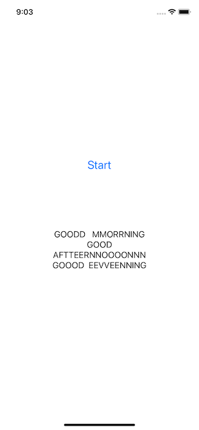
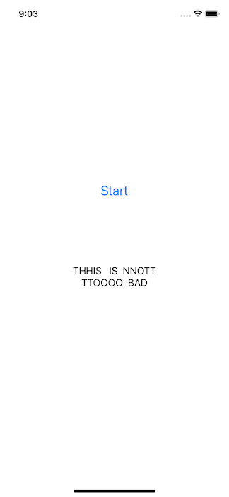
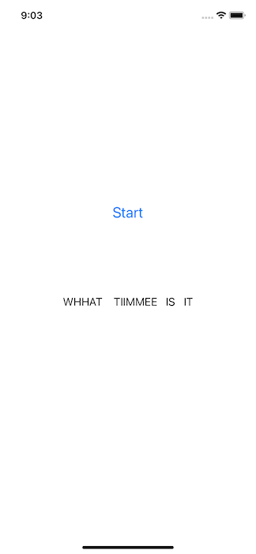

# Speech Recognition on iOS with Wav2Vec2

## Introduction

Facebook AI's [wav2vec 2.0](https://github.com/pytorch/fairseq/tree/master/examples/wav2vec) is one of the leading models in speech recognition. It is also available in the [Hugging Face Transformers](https://github.com/huggingface/transformers) library, which is also used in another PyTorch iOS demo app for [Question Answering](https://github.com/pytorch/ios-demo-app/tree/master/QuestionAnswering).

In this demo app, we'll show how to quantize, trace, and optimize the wav2vec2 model, powered by the newly released torchaudio 0.9.0, and how to use the converted model on an iOS demo app to perform speech recognition.

## Prerequisites

* PyTorch 1.9.0 and torchaudio 0.9.0 (Optional)
* Python 3.8 or above (Optional)
* iOS PyTorch Cocoapods library LibTorch 1.9.0
* Xcode 12.4 or later

## Quick Start

### 1. Get the Repo

Simply run the commands below:

```
git clone https://github.com/pytorch/ios-demo-app
cd ios-demo-app/SpeechRecognition
```

If you don't have PyTorch 1.9.0 and torchaudio 0.9.0 installed or want to have a quick try of the demo app, you can download the quantized scripted wav2vec2 model file [here](https://drive.google.com/file/d/1RcCy3K3gDVN2Nun5IIdDbpIDbrKD-XVw/view?usp=sharing), then drag and drop to the project, and continue to Step 3.

Be aware that the downloadable model file was created with PyTorch 1.9.0 and torchaudio 0.9.0, matching the iOS LibTorch library 1.9.0 specified in the `Podfile`. If you use a different version of PyTorch to create your model by following the instructions below, make sure you specify the same iOS LibTorch version in the `Podfile` to avoid possible errors caused by the version mismatch. Furthermore, if you want to use the latest prototype features in the PyTorch master branch to create the model, follow the steps at [Building PyTorch iOS Libraries from Source](https://pytorch.org/mobile/ios/#build-pytorch-ios-libraries-from-source) on how to use the model in iOS.


### 2. Prepare the Model

To install PyTorch 1.9.0 and torchvision 0.10.0, you can do something like this:

```
conda create -n wav2vec2 python=3.8.5
conda activate wav2vec2
pip install torch torchvision
```

Now with PyTorch 1.9.0 and torchaudio 0.9.0 installed, run the following commands on a Terminal:

```
python create_wav2vec2.py
```

This will create the model file `wav2vec2.pt` and save to the `SpeechRecognition` folder.

### 2. Use LibTorch

Run the commands below:

```
pod install
open SpeechRecognition.xcworkspace/
```

### 3. Build and run with Xcode

After the app runs, tap the Start button and start saying something; after 12 seconds (you can change `private let AUDIO_LEN_IN_SECOND = 12` in `ViewController.swift` for the recording length), the model will infer to recognize your speech. Some example results are as follows:




