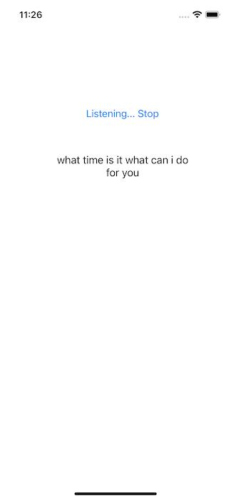
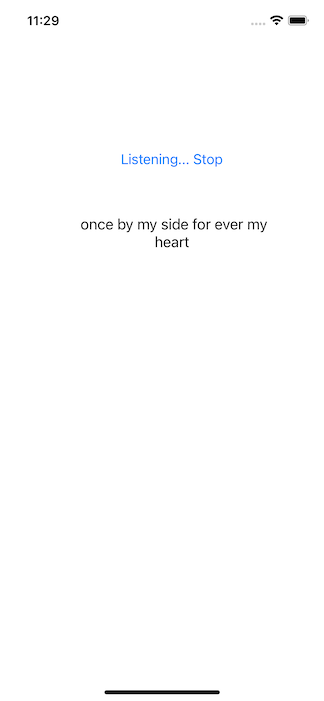

# Streaming Speech Recognition on iOS with Emformer-RNNT-based Model

## Introduction

In the Speech Recognition iOS [demo app](https://github.com/pytorch/ios-demo-app/tree/master/SpeechRecognition), we showed how to use the [wav2vec 2.0](https://github.com/pytorch/fairseq/tree/master/examples/wav2vec) model on an iOS demo app to perform non-continuous speech recognition. Here we're going one step further, using a torchaudio [Emformer-RNNT-based ASR](https://pytorch.org/audio/main/prototype.pipelines.html#torchaudio.prototype.pipelines.EMFORMER_RNNT_BASE_LIBRISPEECH) model in iOS to perform streaming speech recognition.

This demo uses iOS [AVAudioEngine](https://developer.apple.com/documentation/avfaudio/avaudioengine) instead of [AVAudioRecorder](https://github.com/pytorch/ios-demo-app/blob/master/SpeechRecognition/SpeechRecognition/ViewController.swift#L24) to perform live audio processing for the streaming speech recognition model. AVAudioRecorder is simple to use, but you can't process the audio before it is written to a target file. AVAudioEngine is a lot more powerful and supports real-time audio analysis.


## Prerequisites

* PyTorch 1.10.1 and torchaudio 0.10.1 (Optional)
* Python 3.8 or above (Optional)
* iOS Cocoapods LibTorch-Lite 1.10.0
* Xcode 13 or later

## Quick Start

### 1. Get the Repo

Simply run the commands below:

```
git clone https://github.com/pytorch/ios-demo-app
cd ios-demo-app/StreamingASR
```

If you don't have PyTorch 1.10.1 and torchaudio 0.10.1 installed or want to have a quick try of the demo app, you can download the optimized scripted model file [streaming_asr.ptl](https://drive.google.com/file/d/1awT_1S6H5IXSOOqpFLmpeg0B-kQVWG2y/view?usp=sharing), then drag and drop it to the project, and continue to Step 3.


### 2. Test and Prepare the Model

To install PyTorch 1.10.1, torchaudio 0.10.1, and other required Python packages (numpy and pyaudio), do something like this:

```
conda create -n pt1.10.1 python=3.8.5
conda activate pt1.10.1
pip install torch torchaudio numpy pyaudio
```

Now download the streaming ASR model file
[scripted_wrapper_tuple_no_transform.pt](https://drive.google.com/file/d/1_49DwHS_a3p3THGdHZj3TXmjNJj60AhP/view?usp=sharing) to the `ios-demo-app/StreamingASR` directory.

To test the model, run `python run_sasr.py`. After you see:
```
Initializing model...
Initialization complete.
```
say something like "good afternoon happy new year", and you'll likely see the streaming recognition results `▁good ▁afternoon ▁happy ▁new ▁year` while you speak. Hit Ctrl-C to end.

To optimize and convert the model to the format that can run on iOS, run the following commands:
```
python save_model_for_mobile.py
mv streaming_asr.ptl StreamingASR
```

### 3. Use LibTorch

Run the command `pod install`, and you will see:

```
Installing LibTorch-Lite (1.10.0)
Installing PlainPocketFFT (0.0.9)
Installing PocketFFT (0.0.1)
Installing RosaKit (0.0.6)
```

The [RosaKit](https://github.com/dhrebeniuk/RosaKit) library is used to perform the audio [MelSpectrogram](https://pytorch.org/audio/stable/transforms.html#melspectrogram install) transformation.

Now run `open StreamingASR.xcworkspace` to open the project in Xcode.


### 4. Build and run with Xcode

After the app runs, tap the Start button and start saying something. Unlike the wav2vec2 Speech Recognition demo app, you can perform streaming speech recognition without having to wait for the input audio to be recorded. Some example results are as follows:




