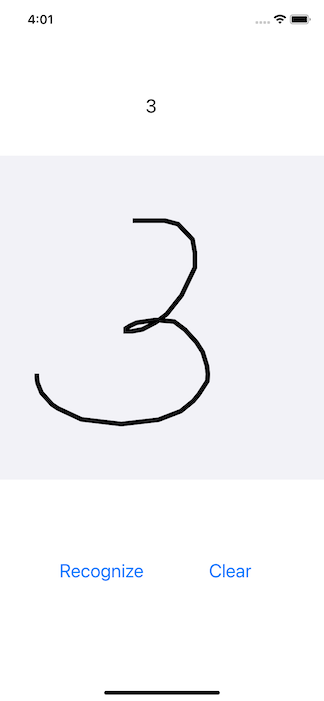
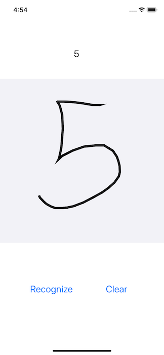
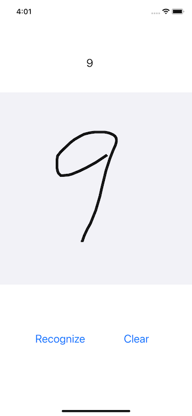

# Vision Transformer with ImageNet and MNIST on iOS

## Introduction

[ImageNet](http://image-net.org) is the most popular image dataset on which the breakthrough of deep learning took place in 2012. The handwritten digit dataset [MNIST](https://en.wikipedia.org/wiki/MNIST_database) is the oldest and most commonly used dataset for machine learning. And the Vision Transformer (ViT - [blog](https://ai.googleblog.com/2020/12/transformers-for-image-recognition-at.html) and [paper](https://arxiv.org/abs/2010.11929)) is one of the most recent models in deep learning, applying the revolutionary [transformer](ttps://arxiv.org/abs/1810.04805) model that was first successfully applied in natural language processing to computer vision.

In this demo app, we'll integrate the two oldest and most popular image datasets with the latest deep learning model and show you:

1. How to use the [Facebook DeiT](https://github.com/facebookresearch/deit) model, a ViT model pre-trained on ImageNet, for image classification on iOS;

2. How to train another [ViT model on MNIST](https://towardsdatascience.com/a-demonstration-of-using-vision-transformers-in-pytorch-mnist-handwritten-digit-recognition-407eafbc15b0) and convert it to TorchScript to use on iOS for handwritten digit recognition.

## Prerequisites

* PyTorch 1.7 or later (Optional)
* Python 3.8 (Optional)
* iOS PyTorch pod library 1.7
* Xcode 12 or later

## Quick Start on Using Facebook DeiT

### 1. Prepare the Model (Optional)

To use a pre-trained Facebook DeiT model and convert it to TorchScript, simply run the following script with PyTorch 1.7 installed:
```
python convert_deit.py
```

This will generate the quantized scripted model named `fbdeit.pt`, which can also be downloaded [here](https://drive.google.com/file/d/1CN5BCYPh78uT2GCEobcOMtk5HSX3qe1x/view?usp=sharing). Note that the quantization code in the script reduces the model size from 346MB to 89MB. 

To train and convert your own DeiT model on ImageNet, first follow the instructions under Data Preparation and Training at the [DeiT repo](https://github.com/facebookresearch/deit), then simply run the following code after `model` is trained:
```
from torch.utils.mobile_optimizer import optimize_for_mobile
ts_model = torch.jit.script(model)
optimized_torchscript_model = optimize_for_mobile(ts_model)
optimized_torchscript_model.save("fbdeit.pt")
```

### 2. Run the Model on iOS

The official [PyTorch iOS HelloWorld](https://github.com/pytorch/ios-demo-app#the-helloworld-example) example app uses MobileNet v2 for image classification. To run the converted `fbdeit.pt` on iOS, first follow the steps in the HelloWorld example to make sure it works (the LibTorch version used in the [Podfile](https://github.com/pytorch/ios-demo-app/blob/master/HelloWorld/HelloWorld/Podfile) needs to be 1.7.0, to be consistent with the PyTorch version used to generate the model file).

Then, drag and drop the `fdbeit.pt` model generated or downloaded in Step 1 to the HelloWorld Xcode project.

Finally, change the line of code in the project's [ViewController.swift](https://github.com/pytorch/ios-demo-app/blob/master/HelloWorld/HelloWorld/HelloWorld/ViewController.swift) file from:
```
if let filePath = Bundle.main.path(forResource: "model", ofType: "pt"),
```
to
```
if let filePath = Bundle.main.path(forResource: "fbdeit", ofType: "pt"),
```

Run the app in Xcode and you'll see the same image classification result.


## Quick Start on Using ViT for MNIST

To Test Run the iOS ViT4MNIST demo app, follow the steps below:

### 1. Prepare the Model (Optional)

On a Terminal, with PyTorch 1.7 installed, run:
```
python mnist_vit.py
```

The model definition in `vit_pytorch.py` and training code in `mnist_vit.py` are mostly taken from the blog [here](https://towardsdatascience.com/a-demonstration-of-using-vision-transformers-in-pytorch-mnist-handwritten-digit-recognition-407eafbc15b0). After the training, which takes about 20 minutes on a MacBook Pro, the model is converted to TorchScript and saved as `vit4mnist.pth`, which should be the same as the one already added in the app project.

### 2. Use LibTorch

Run the commands below:

```
cd ViT4MNIST
pod install
open ViT4MNIST.xcworkspace/
```

### 3. Build and run with Xcode

Select an iOS simulator or device on Xcode to run the app. Some example results are as follows:




